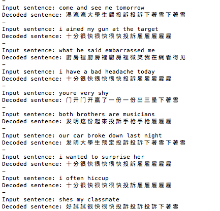

# Keras-LSTM-Exercise
Playing with Keras. 
Following a tutorial from the official Keras blog, I was trying to develop a simple code for Neural Machine Translation.

I used the word-level model, for English-Chinese translation. 
Perhaps due to not enough training data, the performance was really bad:  
  
It doesn't make any sense at all.
Oberving the output, it seemed that the model wouldn't be able to correctly predict the end of sentence character (in my case, '\n').  
Trying to use char-level model didn't help any better.  
Then I also tried to do the English-Spanish translation.
Still a very bad result.  
Next time I would try to use a bigger sized training data.
Also, any suggestion is appreciated.
